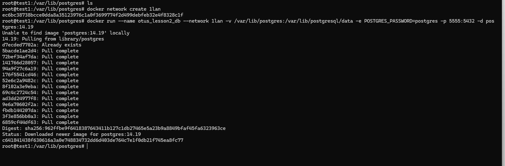
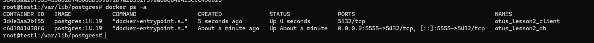
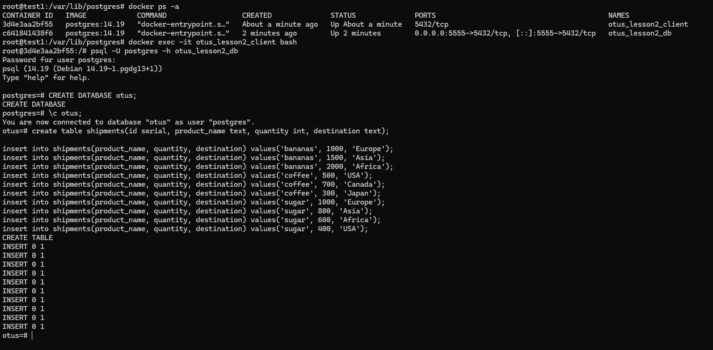
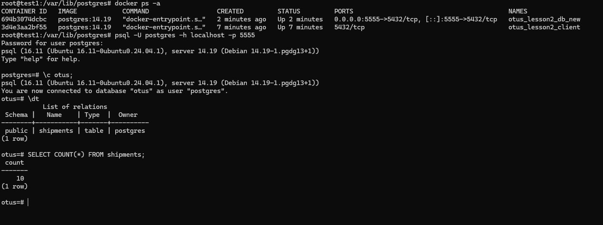

# Установка и настройка PostgteSQL в контейнере Docker

## 1. Создайте инстанс с Ubuntu 20.04 в Яндекс.Облаке или аналогах.
работы выполнены в старой ранее созданной ВМ
## 2. Установите Docker Engine.
docker.io успешно установлен 
## 3. Создайте каталог /var/lib/postgres для хранения данных.
каталог создан
## 4. Разверните контейнер с PostgreSQL 14, смонтировав в него /var/lib/postgres.
видно пустую директорию и ключ запуск -v

## 5. Разверните контейнер с клиентом PostgreSQL.
отдельный контейнер развернут без ключа -v и внешнего порта

## 6. Подключитесь из контейнера с клиентом к контейнеру с сервером и создайте таблицу с данными о перевозках.
подключение, создание, инсерты выполнены  

## 7. Подключитесь к контейнеру с сервером с ноутбука или компьютера.
выполнено
## 8. Удалите контейнер с сервером и создайте его заново.
удален контейнер, создан новый с именем otus_lesson2_db_new
## 9. Проверьте, что данные остались на месте.
да конечно, ведь папку /var/lib/postgres я не удалял, а новый контейнер смотрит туда же
выполнено подключение и проверка с клиента контейнера.

  
А так же выполнил через локальный клиент на внешний порт контейнера, указанный при создании 5555

