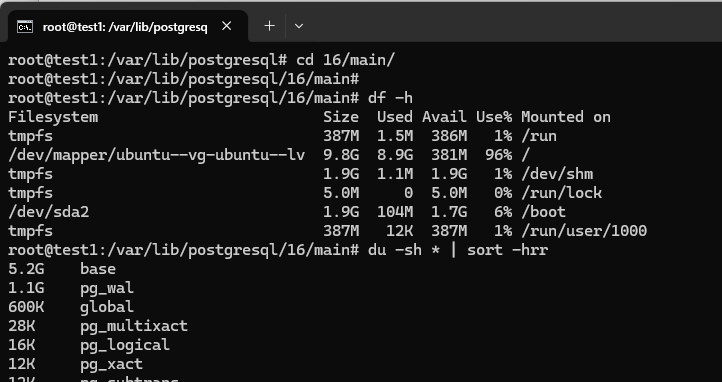
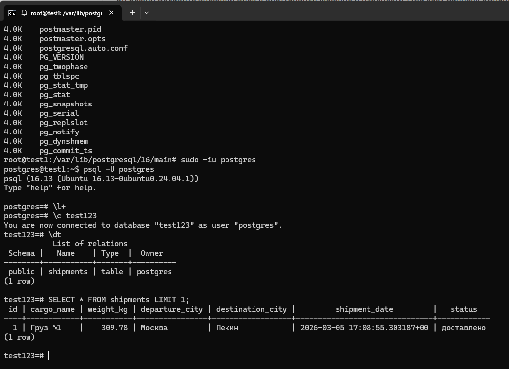
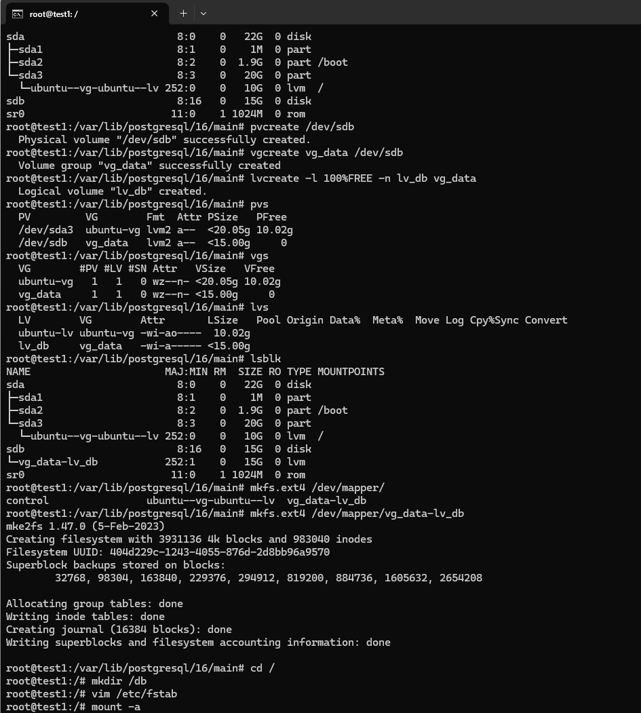
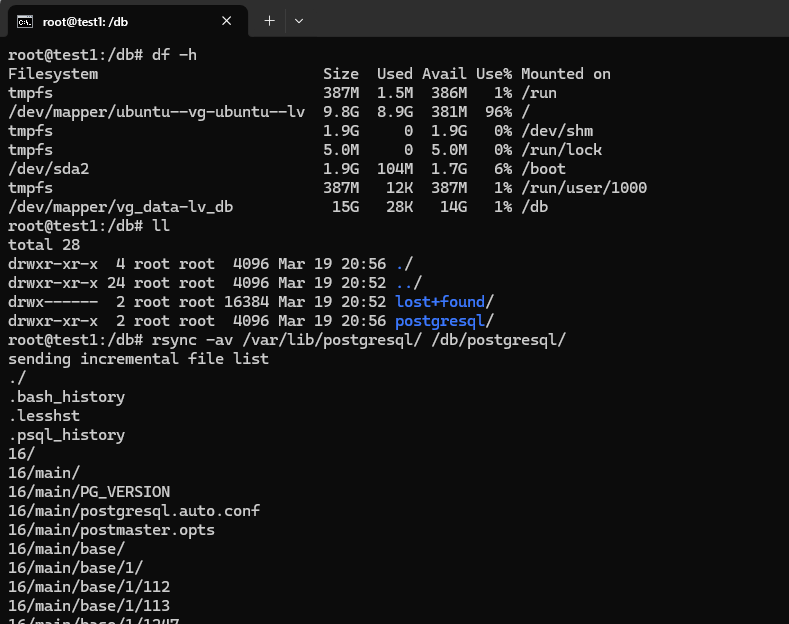
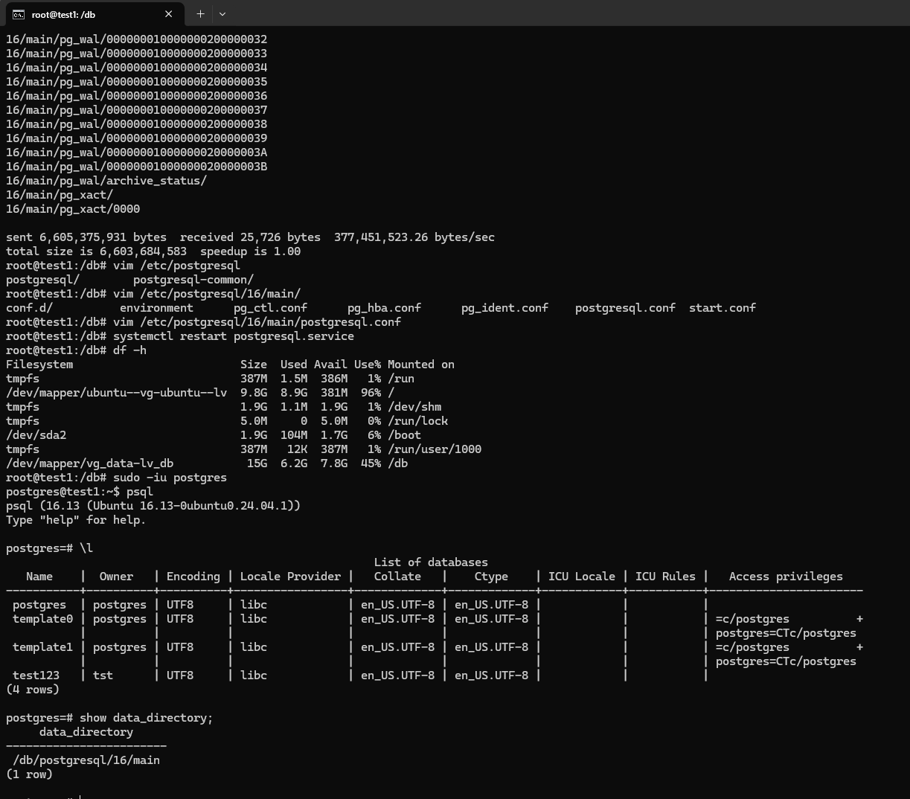
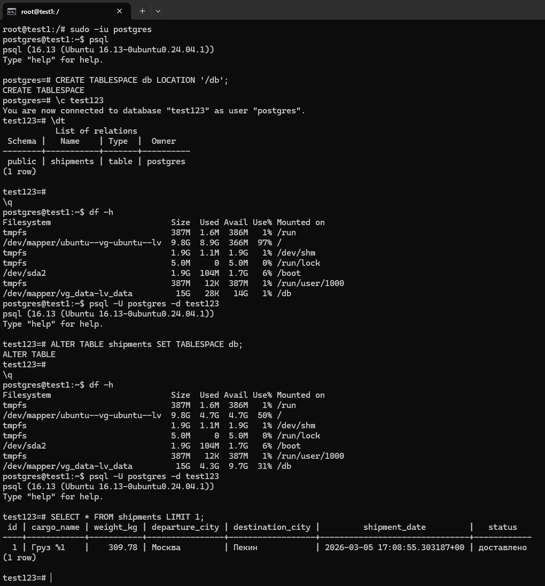

# Настройка PostgreSQL 

## Создана виртуальная машина и установлен PG 16. Создана таблица и сгенерированы данные на 96% заполнения раздела
скрин разделов и таблицы

## Подан доп.диск, создание VG, LV группы и добавление в FSTAB, монтирование диска

## Копирование БД на доп.диск через rsync, чтобы права не слетели

## Меняю путь data_directory в конфиге на новый диск, запуск БД и show config для подтверждения

# Альтернатива
## Не переношу каталог БД, а создаю новый tablespace и делаю ALTER TABLE таблицы, если нужен онлайн режим можно юзать pg_repack
