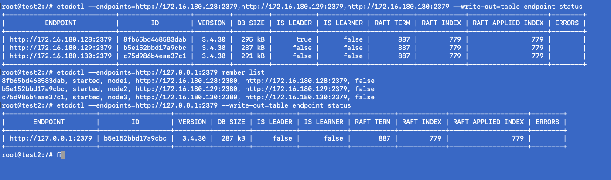
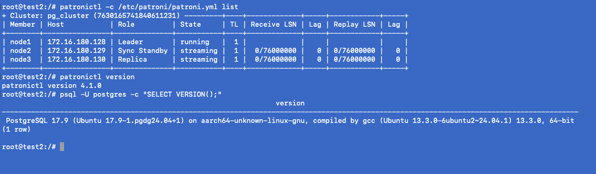
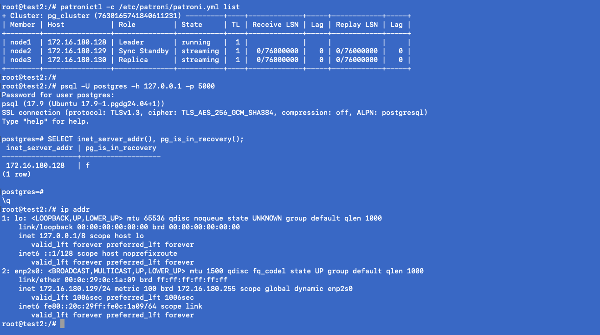
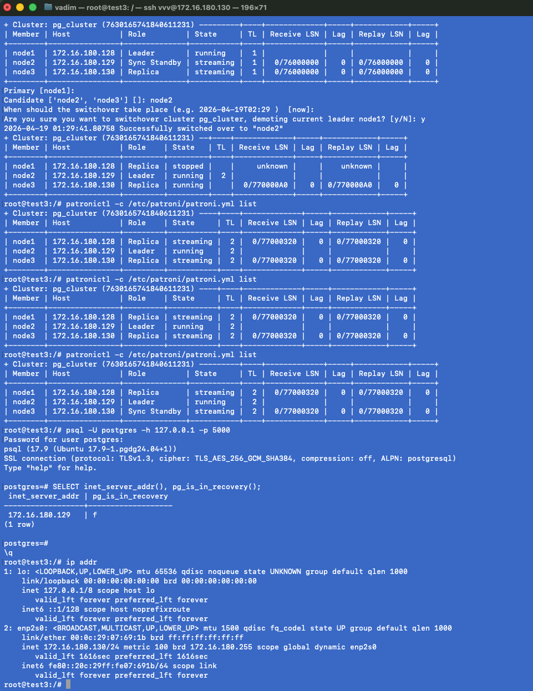
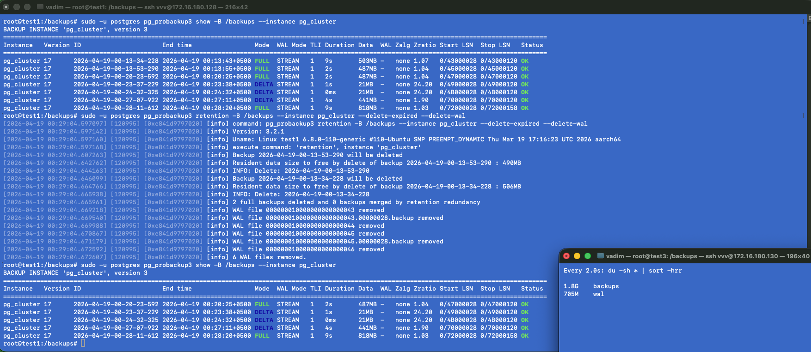

# Постоение кластера Patroni 

# Поднятие ETCD кластера
**установлен и собран в кластер ETCD**

# PostgreSQL/Patroni
**Установлен PostgreSQL 17 и собран в кластер под управлением Patroni

# HAProxy
**Установлен HAProxy на все 3 ноды на порту 5000

# Switchover
**Сделано переключение лидера, проверен TL и статус всех нод кластера + проверка подключение через HAProxy на нового лидера

# Pg_Probackup
**Были попытки установить версию до 3, не нашел дистрибутива для arm64 ubuntu. Установлена версия выше 3. Создание полного бэкапа, дельты, удаление бэкапов устаревших
