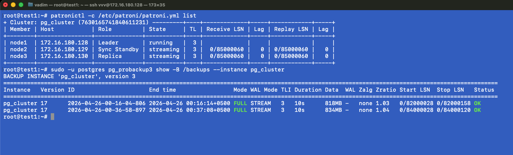
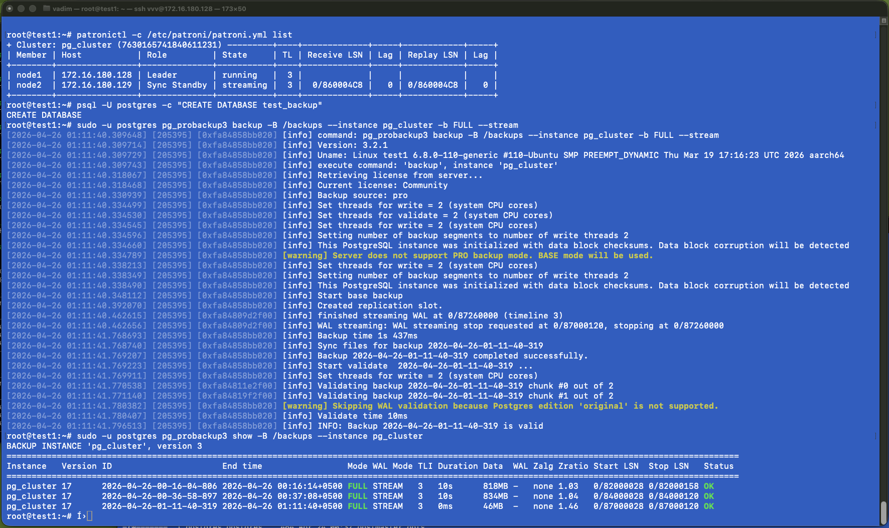
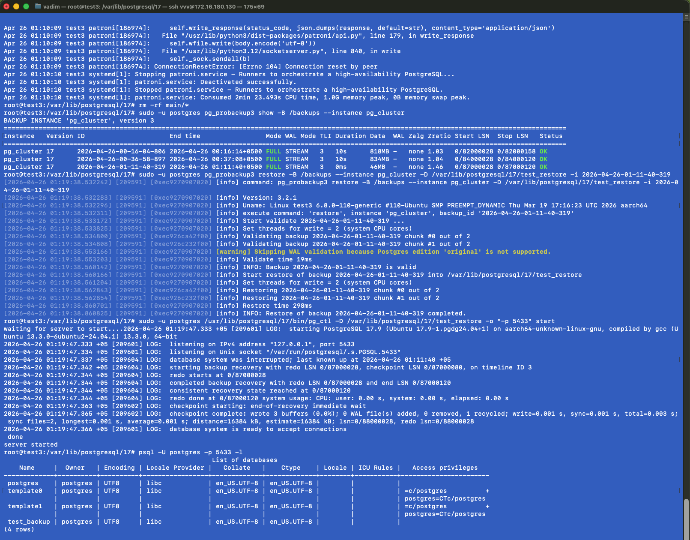
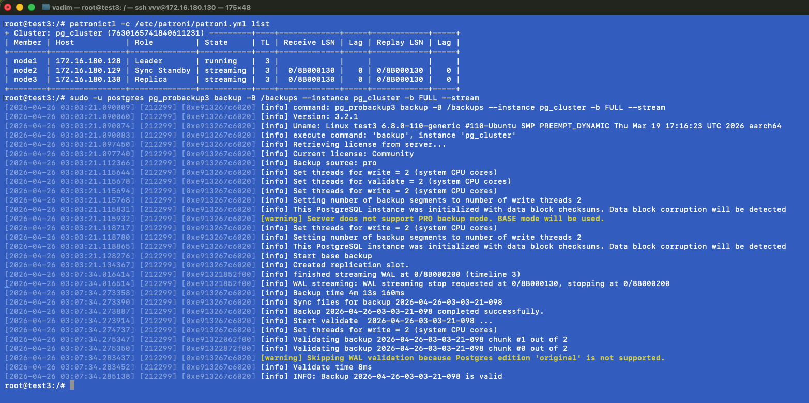

## 5 УРОК - Углубленное изучение бэкапов

### Работающий кластер и просмотр бэкапов

### Создана тестовая БД и сделан актуальный бэкап для восстановления

### Потушена нода на 3реплике, удалена папка с БД. Выполнено восстановление актуального бэкапа. Запуск postgresql на порту 5433 с явным указанием директории, куда делали восстановление, проверяю наличие БД test_backup

### Запуск бэкапа с ноды реплики, долгое создание слота обусловлено тем, что реплика не может сбросить файлы и ждем чекпоинта лидера и далее уже делает бэкап.
