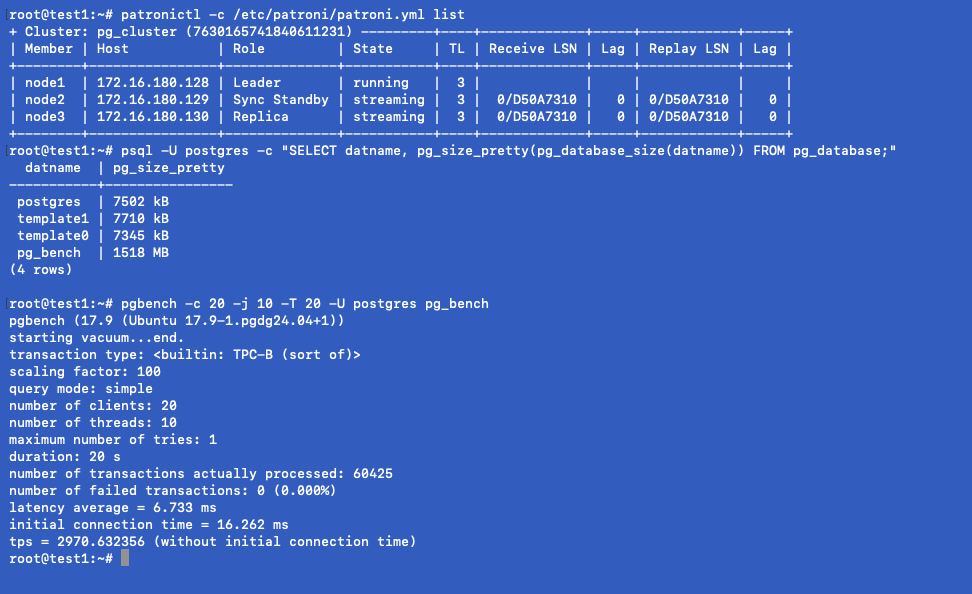
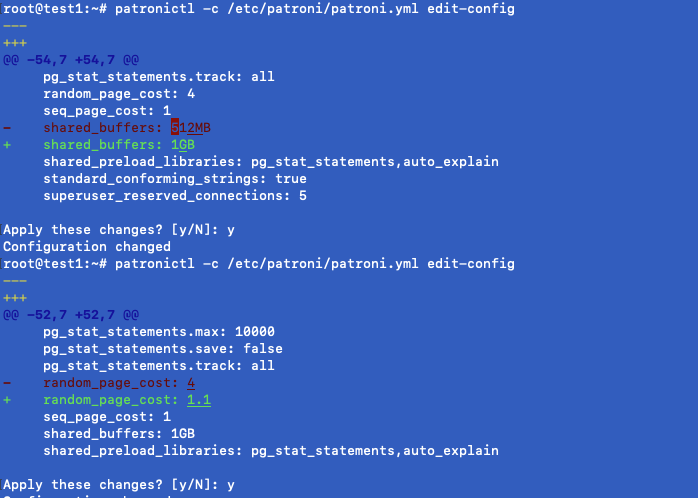
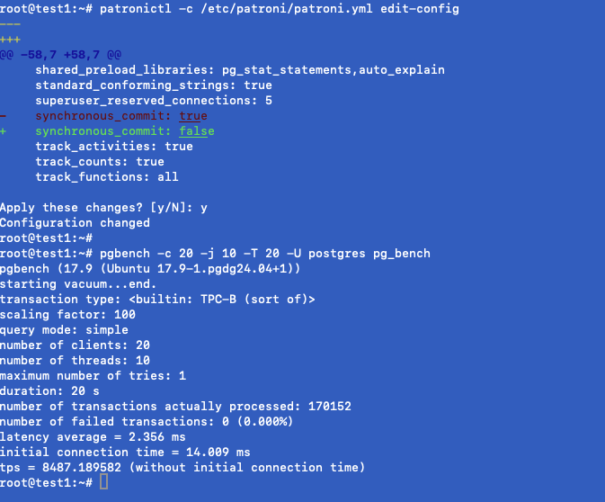
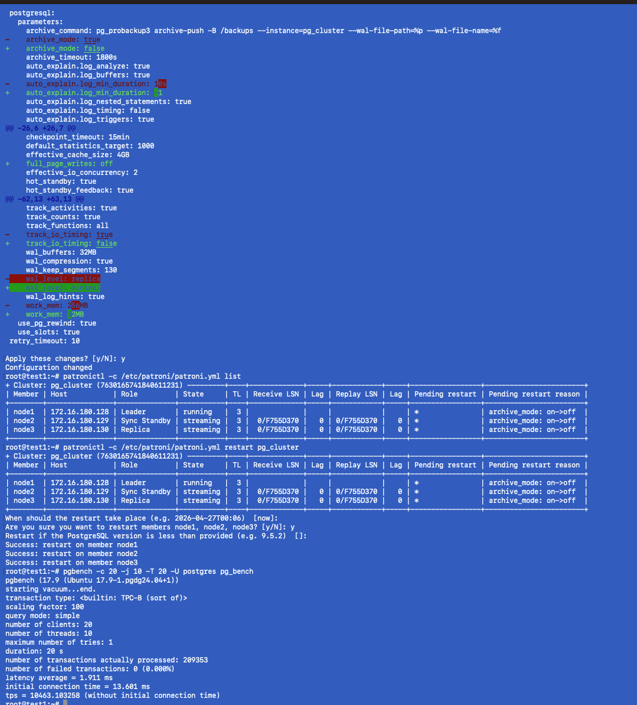
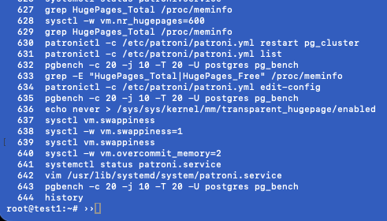

## 5 УРОК - Углубленный анализ производительности. Профилирование. Оптимизация 

### Работающий кластер, создана БД и сгенерированны данные на 1,5GB и запущен первичный pg_bench

### Изменение параметров кластера shareb_buffers, random_page_cost

### Сделан рестарт кластера для применения, а так же выключен sync_commit и проведены замеры с теми же параметрами pg_bench

### Для экстремальной производительности не обращая внимания на стабильность изменены параметры архивирования, логов, данных wal_level, уменьшен work_mem, выключен параметр full_page_writes и проведены замеры
з

### Изменены настройки ОС, а именно включены hugepage, параметр использования оперативной памяти. Не дало выхлоп из-за небольшего количества оперативной памяти
