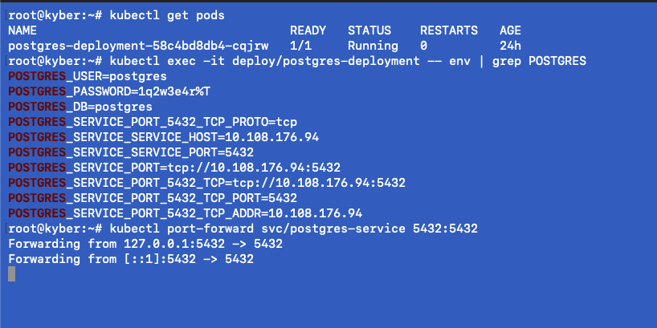
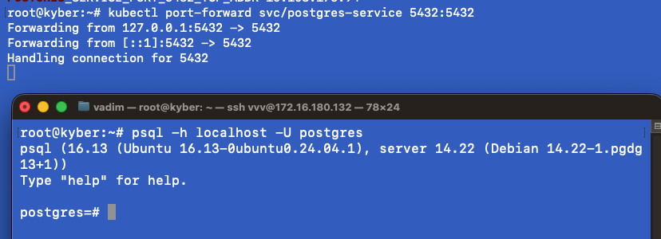
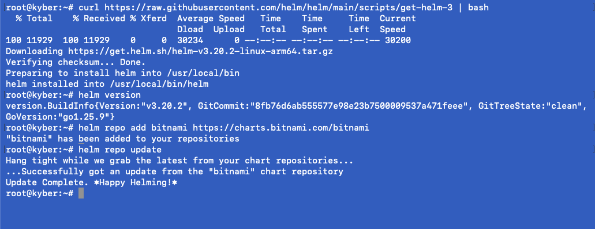
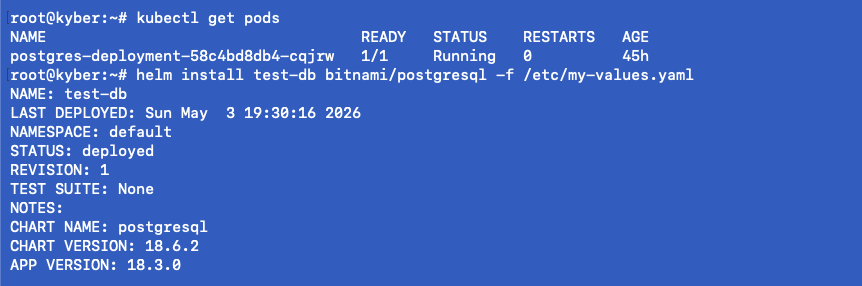
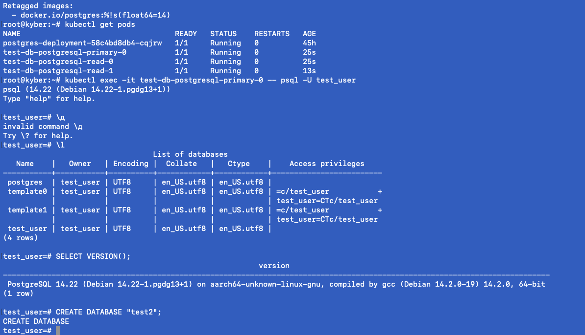

## 10 УРОК - Введение в Kubernetes: Работа с хранилищами данных и конфигурациями 

### Установлен и поднят под кубера. Показаны манифет и проброшены порты

### Подключение к БД пода

### Установка HELM, проверка версии и подключение репозитория Bitnami

### Установка PostgreSQL через helm с указанием файла конфигурации.

### Подняты 3 ноды PostgreSQL. Подключение к ноде контейнера, проверка версии и создание БД.
