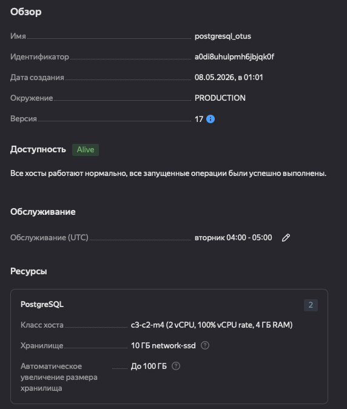
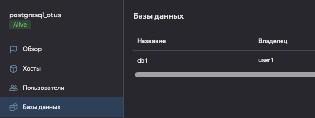
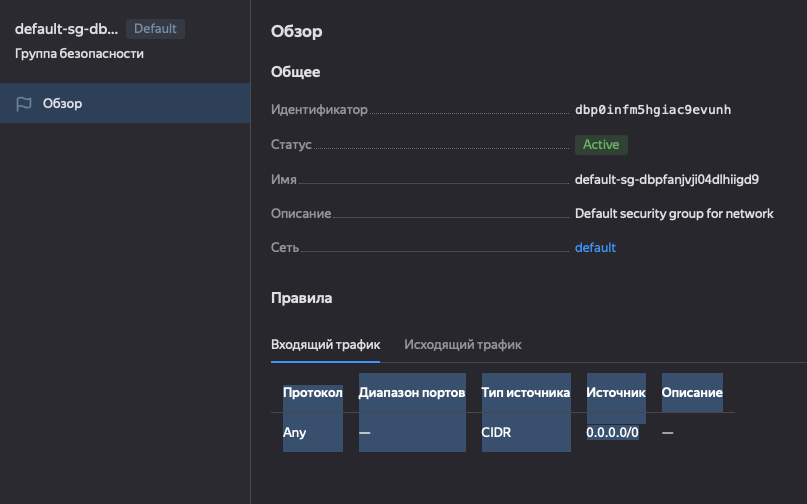
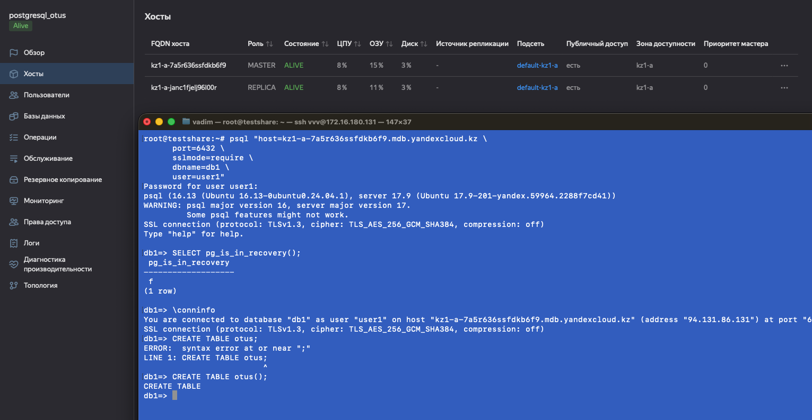

## 14 УРОК - PostgreSQL и Yandex Cloud: построение отказоустойчивого кластера и аналитики 

### Создан и поднят кластер с минимальными хар-ки

### Имя БД и пользователя

### Проверка группы безопасности, убедиться что я смогу подключиться, оставил со всех адресов

### Подключение к лидеру с выполнением команды и реплике
